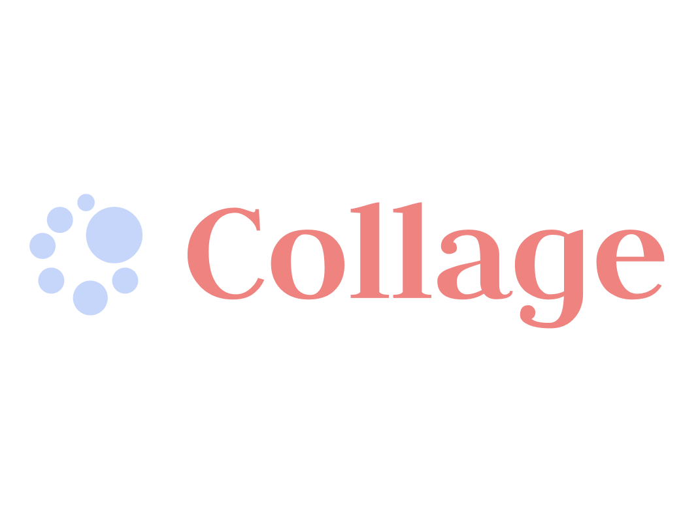
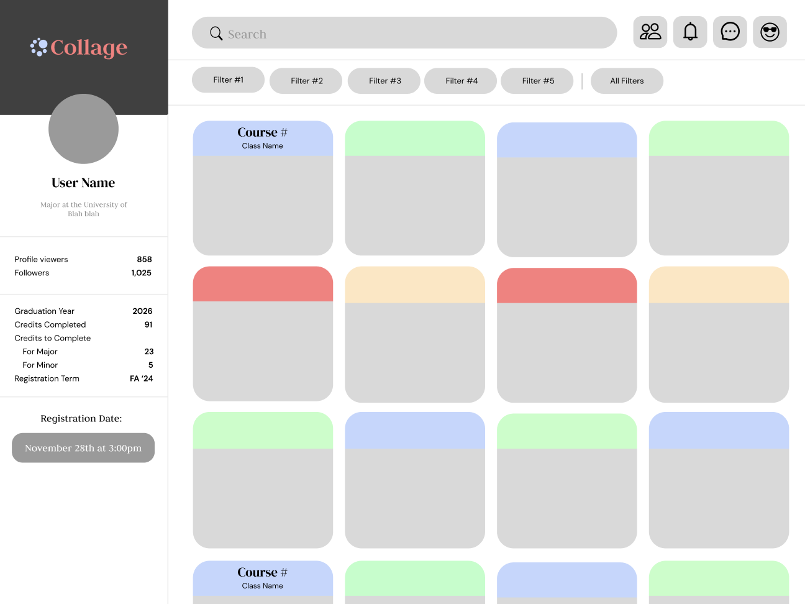
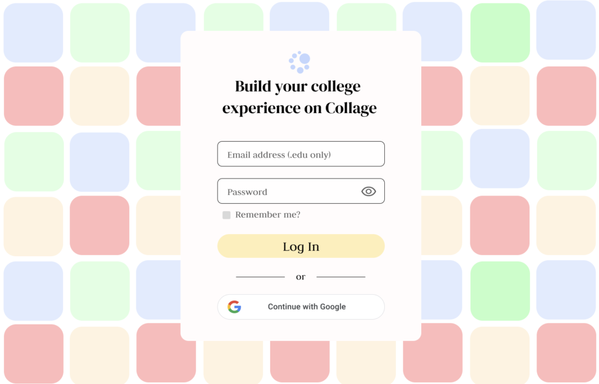

<!-- Improved compatibility of back to top link: See: https://github.com/othneildrew/Best-README-Template/pull/73 -->
<a name="readme-top"></a>
<!--
*** Thanks for checking out the Best-README-Template. If you have a suggestion
*** that would make this better, please fork the repo and create a pull request
*** or simply open an issue with the tag "enhancement".
*** Don't forget to give the project a star!
*** Thanks again! Now go create something AMAZING! :D
-->


<!-- PROJECT SHIELDS -->
<!--
*** I'm using markdown "reference style" links for readability.
*** Reference links are enclosed in brackets [ ] instead of parentheses ( ).
*** See the bottom of this document for the declaration of the reference variables
*** for contributors-url, forks-url, etc. This is an optional, concise syntax you may use.
*** https://www.markdownguide.org/basic-syntax/#reference-style-links
-->
[![Contributors][contributors-shield]][contributors-url]
[![Forks][forks-shield]][forks-url]
[![Stargazers][stars-shield]][stars-url]
[![Issues][issues-shield]][issues-url]
<!-- [![License][license-shield]][license-url] -->
<!-- [![LinkedIn][linkedin-shield]][linkedin-url] -->


<!-- PROJECT LOGO -->
<br />
<div align="center">
  <a href="https://github.com/collage-us/collage">
    
  </a>
<h3 align="center">Collage</h3>
  <p align="center">
    A Platform for Personalized Course Planning and AI Academic Advising,
  </p>
  <p align="center">
    Made by College Students, for College Students
  </p>
</div>


<!-- TABLE OF CONTENTS -->
<details>
  <summary>Table of Contents</summary>
  <ol>
    <li>
      <a href="#about-the-project">About The Project</a>
    </li>
    <li>
      <a href="#getting-started">Getting Started</a>
      <ul>
        <li><a href="#prerequisites">Prerequisites</a></li>
        <li><a href="#installation">Installation</a></li>
      </ul>
    </li>
    <li><a href="#usage">Usage</a></li>
    <li><a href="#license">License</a></li>
    <!-- <li><a href="#contact">Contact</a></li> -->
    <!-- <li><a href="#acknowledgments">Acknowledgments</a></li> -->
  </ol>
</details>


<!-- ABOUT THE PROJECT -->
## About the Platform

### Platform Demo

<div align="center">
  
  
</div>

### Collage is College Redefined
Higher education is at a crossroads. The traditional college class is becoming increasingly obsolete as we’ve witnessed lower attendance and lower grades, and the amount of students using generative AIs like ChatGPT to complete their work has skyrocketed. The way college operates is rapidly evolving and that is largely due to one key development in consumer demand: personalization.

From the TikTok for you page to the Amazon marketplace, a personalized user experience has become a top priority for highly successful companies looking to keep their customers engaged. Consumers want products and services that are personally tailored to their wants and needs. The same goes for college students with their education. If universities want their students to reengage they need to personalize the user experience. Colleges need to start looking at themselves not solely as educational institutions, but as tech and social media companies as well.

This is the guiding mission of Collage. Collage is an education technology platform that uses artificial intelligence and social media to help students craft personalized class schedules, explore career paths, and make informed decisions about their education. We are a student-run startup striving to give students around the world a more equitable, enjoyable, and personalized college experience

<!-- [![Product Name Screen Shot][product-screenshot]](https://example.com) -->
#### Never Stress about Class Scheduling Again
Collage is here to completely overhaul your registration process.
#### Personalized Course Planning
Courses best fit to enhance your college experience will be recommended to you through an infinite scrolling system.
#### AI Academic Advising
Our custom Large Language Model (LLM) is fine tuned to help you plan your perfect class schedule with ease.

> More information about the company and the platform can be found here [collageapp.info](https://collageapp.info/).

<p align="right">(<a href="#readme-top">back to top</a>)</p>


<!-- GETTING STARTED -->
## Getting Started

Please follow these steps below to set up the project locally.

### Prerequisites

We use Python version **3.12.3**. To check your version, run:
```
$ python --version
```

### Install the Dependencies

There's a shell script that contains all the commands you need. As a result, make sure you are in the main directory and then simply run these commands:
```
$ chmod +x ./bin/install.sh
```

```
$ ./bin/install.sh
```

```
$ source env/bin/activate
```

<!-- USAGE EXAMPLES -->
### Run the Project

To run the website locally, follow these following steps:

Make sure you are already in the Python virtual environment
```
$ source env/bin/activate
```

```
$ chmod +x ./bin/run.sh
```

```
$ ./bin/run.sh
```

Then open your browser and go to http://localhost:8001/

<p align="right">(<a href="#readme-top">back to top</a>)</p>


<!-- LICENSE -->
## License

Shield: [![CC BY-NC-ND 4.0][cc-by-nc-nd-shield]][cc-by-nc-nd]

This work is licensed under a
[Creative Commons Attribution-NonCommercial-NoDerivs 4.0 International License][cc-by-nc-nd].

[![CC BY-NC-ND 4.0][cc-by-nc-nd-image]][cc-by-nc-nd]

[cc-by-nc-nd]: http://creativecommons.org/licenses/by-nc-nd/4.0/
[cc-by-nc-nd-image]: https://licensebuttons.net/l/by-nc-nd/4.0/88x31.png
[cc-by-nc-nd-shield]: https://img.shields.io/badge/License-CC%20BY--NC--ND%204.0-lightgrey.svg

See `LICENSE.txt` for more information.

<p align="right">(<a href="#readme-top">back to top</a>)</p>


<!-- CONTACT -->
<!-- ## Contact

Name - [@twitter_handle](https://twitter.com/twitter_handle) - email@email_client.com

Project Link: [https://github.com/github_username/repo_name](https://github.com/github_username/repo_name)

<p align="right">(<a href="#readme-top">back to top</a>)</p> -->


<!-- ACKNOWLEDGMENTS -->
<!-- ## Acknowledgments

* []()
* []()
* []()

<p align="right">(<a href="#readme-top">back to top</a>)</p> -->


<!-- MARKDOWN LINKS & IMAGES -->
<!-- https://www.markdownguide.org/basic-syntax/#reference-style-links -->
[contributors-shield]: https://img.shields.io/github/contributors/collage-us/collage.svg?style=for-the-badge
[contributors-url]: https://github.com/collage-us/collage/graphs/contributors
[forks-shield]: https://img.shields.io/github/forks/collage-us/collage.svg?style=for-the-badge
[forks-url]: https://github.com/collage-us/collage/network/members
[stars-shield]: https://img.shields.io/github/stars/collage-us/collage.svg?style=for-the-badge
[stars-url]: https://github.com/collage-us/collage/stargazers
[issues-shield]: https://img.shields.io/github/issues/collage-us/collage.svg?style=for-the-badge
[issues-url]: https://github.com/collage-us/collage/issues
[license-shield]: https://img.shields.io/github/license/collage-us/collage.svg?style=for-the-badge
[license-url]: https://github.com/collage-us/collage/blob/main/LICENSE.txt
[linkedin-shield]: https://img.shields.io/badge/-LinkedIn-black.svg?style=for-the-badge&logo=linkedin&colorB=555
[linkedin-url]: https://linkedin.com/in/linkedin_username
[product-screenshot]: images/screenshot.png
[Next.js]: https://img.shields.io/badge/next.js-000000?style=for-the-badge&logo=nextdotjs&logoColor=white
[Next-url]: https://nextjs.org/
[React.js]: https://img.shields.io/badge/React-20232A?style=for-the-badge&logo=react&logoColor=61DAFB
[React-url]: https://reactjs.org/
[Vue.js]: https://img.shields.io/badge/Vue.js-35495E?style=for-the-badge&logo=vuedotjs&logoColor=4FC08D
[Vue-url]: https://vuejs.org/
[Angular.io]: https://img.shields.io/badge/Angular-DD0031?style=for-the-badge&logo=angular&logoColor=white
[Angular-url]: https://angular.io/
[Svelte.dev]: https://img.shields.io/badge/Svelte-4A4A55?style=for-the-badge&logo=svelte&logoColor=FF3E00
[Svelte-url]: https://svelte.dev/
[Laravel.com]: https://img.shields.io/badge/Laravel-FF2D20?style=for-the-badge&logo=laravel&logoColor=white
[Laravel-url]: https://laravel.com
[Bootstrap.com]: https://img.shields.io/badge/Bootstrap-563D7C?style=for-the-badge&logo=bootstrap&logoColor=white
[Bootstrap-url]: https://getbootstrap.com
[JQuery.com]: https://img.shields.io/badge/jQuery-0769AD?style=for-the-badge&logo=jquery&logoColor=white
[JQuery-url]: https://jquery.com